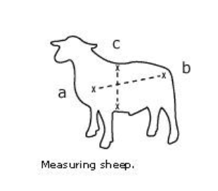

# Small Ruminants: Sheep and Goats

# Breeds of sheep and goats

* A **Breed** is a *population* of animals that are *distinguishable* from other populations with regard to some *visible traits* (**Phenotypic**) which are *genetically determined*.

* A **Type** is  a population of animals showing _phenotypic characteristics_ of a breed without _pedigree records_ and no proof of breed genotype.

* A **Strain** is a genetically distinct population within a breed.

## Breeds of sheep

* Barbados Black Belly
* West African
* Katahdin
* Virgin Island White / St. Croix
* Saint Elizabeth
* Black Head Persian
* Dorper

# Restraint of sheep and Goats

It's best to handle them as a flock initially before isolating the animal you're going to perform procedures on.

Always work gently, calmly, and with assurance.

## Straddling a sheep

* Back the sheep into a corner.
* Straddle animal between legs.
* Squeeze the sheep's shoulders firmly between legs.
* Hold the hard part of the jaw.

## Set up sheep

* While straddling sheep, grasp front legs
* Tilt backwards and place on rump.

## ??

* Approach from the side
* Place finger through the back of the jaw
* Turn head into sheep and press down on rump
* Grab front legs and place sheep between legs

# Weight Determination

Purposes for weighing:
* Recording growth
* Live weight for sale (profitability)
* Determining dosage level
* Amount of feed

1. **Fasted weight** - done in the morning before grazing or watering
2. **Full gut weight** - in the afternoon after animals have eaten as much as they want

## Weigh Tapes/Bands

Species and animal class specific. Developed based on regression analysis between animal's hearth girth and animal's weight.

## Heart Girth and Weight

* Measure the circumference (heart girth) of the animal (C). Ensure accurate measurement by compressing the sheep's hair/wool.

* Measure the length of animal's body (A-B). (Front shoulder to last pin bone)

* Animal Weight in Pounds = Hearth Girth x Hearth Girth X Body Length / 300  
	lengths are in inches.

### Heart Girth (HG) or Chest Circumference

The circumferential measure taken around the chest just behind the front legs and withers. More reliable HG-live body weight relationships are obtained from mature animals. Compress the hair.

# Temperature

Normal body temperature of sheep: **39 °C** (102.3 °F)
Can range from 38 °C to 39.9 °C.

At higher temperatures:

* metabolism increases by panting
* panting increases heat production
* enzymes in the animal's body will cease to function
* death can result

At lower temperatures:

* metabolism increases to produce heat
* the feed is going into heat production rather than building muscle
* enzymes can also cease to function
* death can result

## Taking sheep's temperature

* Insert thermometer gently into sheep's rectum
* Once halfway in, gently push to the side so that the bulb is in contact with the wall
* Keep inside for a count of 20s?
* Remove slowly
* Place finger at mark of mercury
* Hold up to light and take reading against backdrop

**High body temperature** indicates the animal is stressed or the body is fighting an infection.

**Normal body temperature** indicates the problem is due to a non-infectious cause such as metabolic disorder.

**Low body temperature** in very young lambs indicates starvation and in adults may indicate internal bleeding.

## Average rectal temperatures and ranges for livestock

| Species | Average temp (°C) | Temp range (°C) |
| --- | --: | --: |
| cattle (_bovine_) | 38.5 | 36.6 - 39.3 | 
| sheep (_ovine_) | 39.0 | 38.2 - 39.9 |
| goats (_caprine_) | 39.1 | 38.5 - 39.7 |
| pigs (_swine_) | 39.2 | 38.7 - 39.8 |
| horses (_equine_) | 38.0 | 37.2 - 38.2 |